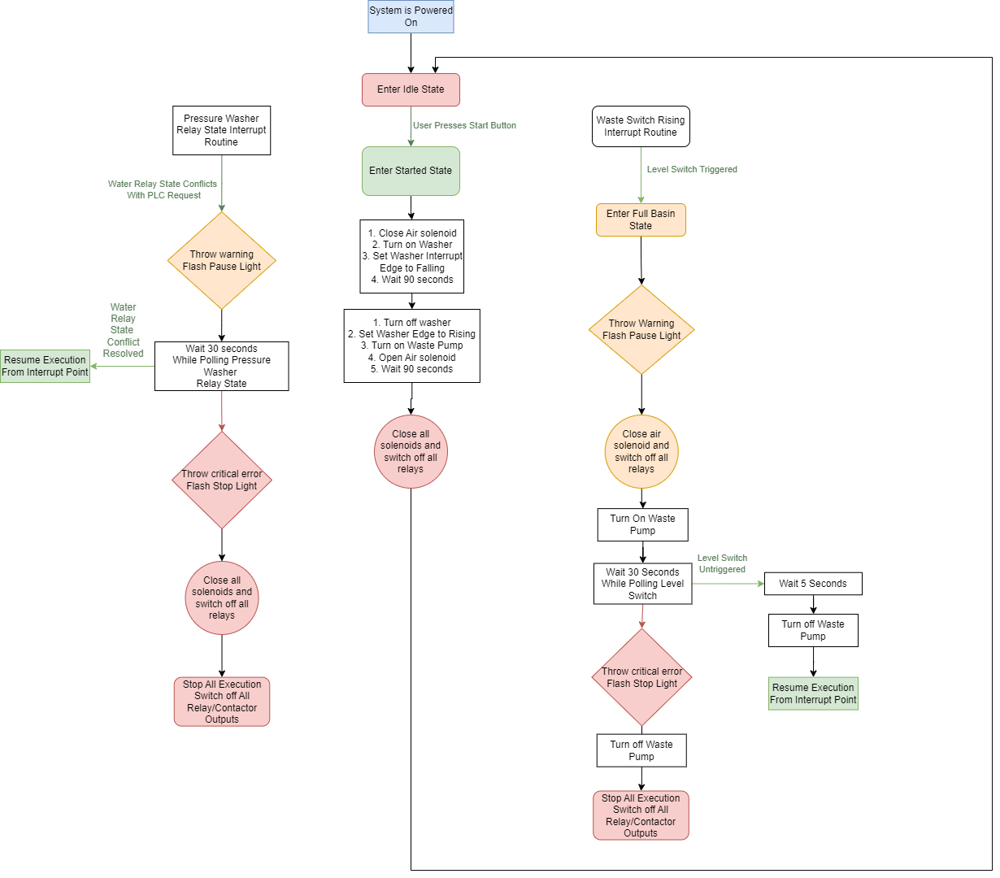
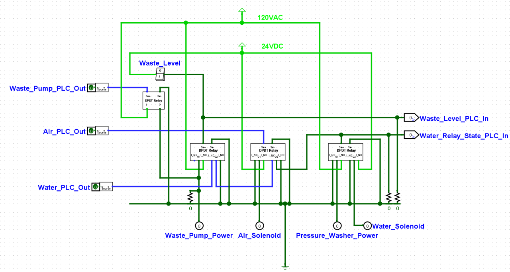
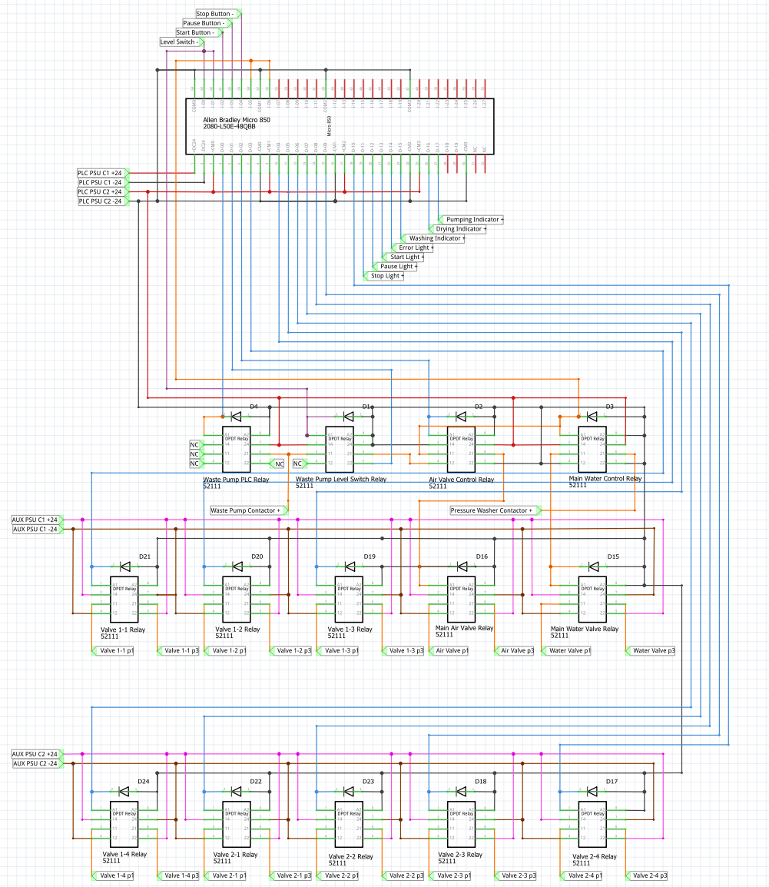
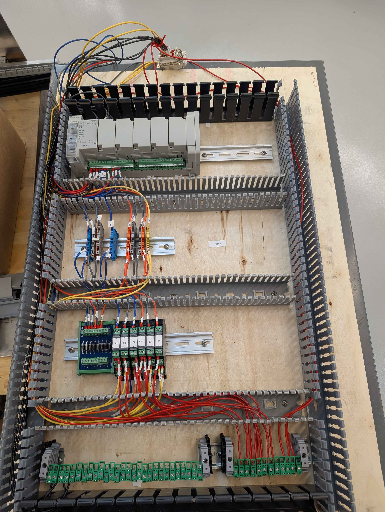
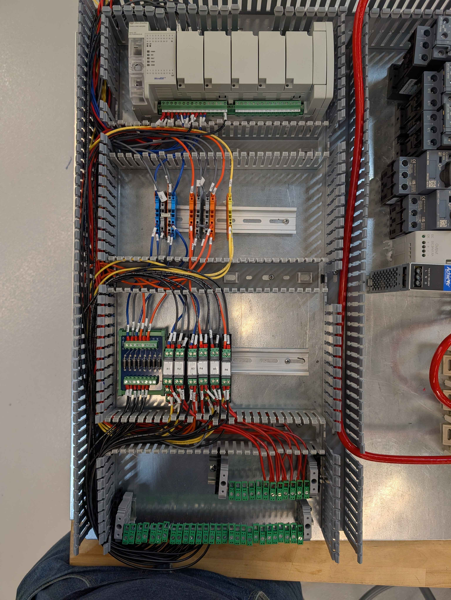
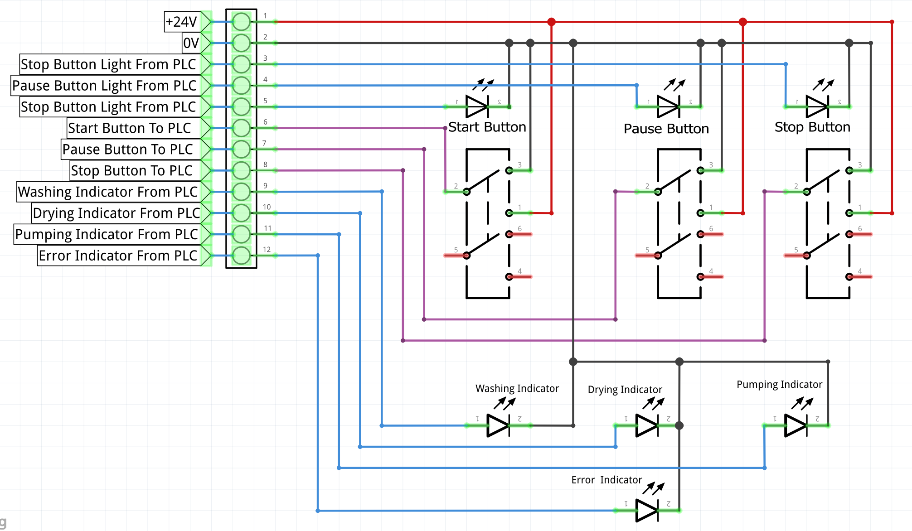
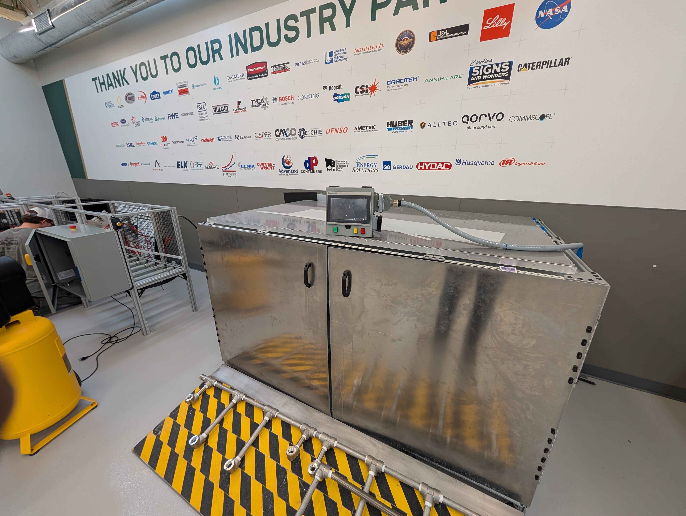

# Intro
For my senior design project, my team was tasked with building an automated wash station for Bosch's grinder carts that are used to transport circular saw blades through the manufacturing process. My part of the project was designing and building the PLC system that controls the pressure washer, compressed air valves, and the wastewater pump. 

The project overview and final mechanical design can be seen in this poster

# Initial Design
I began the design process by mapping out the Process Flow Diagram for the overall system, focusing on efficiency and robustness. My PLC system needed to control power to the pressure washer, the wastewater disposal pump, and the solenoid valves that control the flow of clean water, wastewater, and compressed air for drying.

## Relay Interlocking System

I then designed a relay-interlocking system that ensures, in hardware, the following restrictions
- The pressure washer cannot be powered on, nor the water input solenoid be open while the compressed air solenoid is open
	- This is to ensure water does not enter Bosch's compressed air system
- The pressure washer cannot be powered, nor the water input solenoid be open while the wastewater level float switch is triggered. The wastewater level float switch also powers on the waste pump independently of the PLC
	- This is to ensure the system does not flood with wastewater
# PLC Design

- Once the PLC was chosen, I created a wiring diagram for the PLC, the relays, and the relay protectors
- This diagram was extremely useful when I eventually assembled the system
## Python Netlist Analyzer
- Once I created the Fritzing diagram, I exported the netlist as an XML file
- I then wrote a Python script to analyze this netlist and convert it into a CSV file that contains each net, the number of nodes, and whether or not the net includes a node external to the PLC enclosure
- I used this CSV file for these purposes:
	- To gauge how much wire I needed to buy and of what color (since I assigned each net type a different color)
	- To figure out how many pins the external connectors needed
	- To make checking my final wiring against the initial design much easier
# Plywood Wiring

- Due to ordering issues, the PLC enclosure did not arrive alongside the PLC and all its related components. 
- So as to not waste any time, I mounted all the components to a piece of plywood I bought from Home Depot and started cutting, labeling, and routing the wires according to the diagram and the CSV file
# Final Wiring

- Once the enclosure for the PLC system arrived, I transferred over the components and wires from the plywood into the new enclosure
- I am very proud of the organization and cleanliness of the assembled system

# HMI Design
- For the control interface, I used a touchscreen HMI panel for displaying the system's state, and 3 physical buttons for controlling the machine
- I began with a wiring diagram:

- I then wired together the HMI enclosure and ran a waterproof cable to connect it to the PLC
# Conclusion

Regrettably, due to timing constraints and ordering mishaps, I did not have the time to program the PLC. However, I still gained valuable experience from this project.